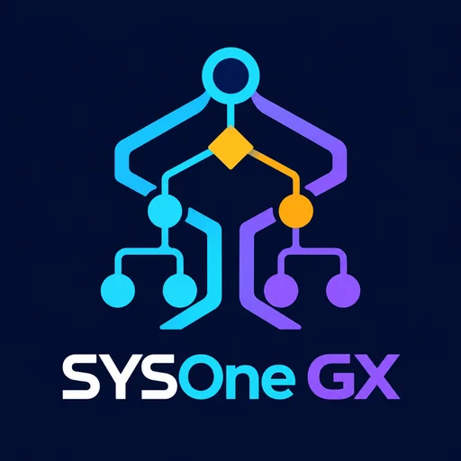
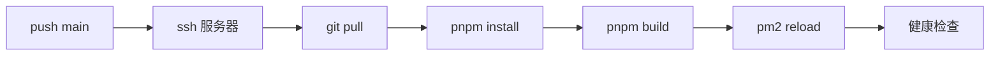

<p align="center">
  
</p>

<h1 align="center">SysOne GX</h1>

<p align="center">
  <strong>TypeSafe System One（Jev）可视化决策工作流工作台</strong><br />
  Visual decision-tree studio, simulator and code exporter for TypeSafe System One models.
</p>

<p align="center">
  <a href="./LICENSE"></a>
  
  
  
  
  
</p>

---

## 📖 目录

- [这是做什么的](#-这是做什么的)
- [✨ 功能特性](#-功能特性)
- [🧱 项目结构](#-项目结构)
- [🛠️ 技术栈](#️-技术栈)
- [🚀 快速开始](#-快速开始)
- [🔌 后端接口一览](#-后端接口一览)
- [🌐 线上部署](#-线上部署)
- [📝 协作约定](#-协作约定摘要)
- [© 许可证](#-许可证mit)

---

## 🎯 这是做什么的

提示工程与 AI 工作流开发者可以在画布上**编排多问题并行评估批次**、**配置置信度兜底防线**、**运行本地仿真或真实模型调用**，并**一键导出可直接落地的生产代码**——专为 TypeSafe System One（Jev）概率决策模型打造。

| 问题类型 | 含义 | 典型用途 |
|:--|:--|:--|
| 🟣 **Choice** | 分类路由 | 工单分流、意图识别 |
| 🔵 **Score** | 有序档位评分 | 严重程度、愤怒值、优先级 |
| 🟢 **Noul** | 校准概率（0~1） | 是否升级人工、是否触发退款 |

---

## ✨ 功能特性

- **🧩 多问题并行评估** — 一次 `client.system_one(state=..., questions={...})` 调用问完所有问题；推测式扇出一次问全量，代码忽略无用答案；下游批处理可一键合并，省一次网络往返。
- **🛡️ 置信度兜底防线** — Choice / Score 走 `confidence` 区间兜底，Noul 走独立校准概率区间送审；Noul 阈值可按问题单独配置（默认 是 ≥0.7 / 否 ≤0.3）。
- **🎨 可视化画布** — React Flow 拖拽编排：评估批处理节点、动作节点（Webhook / 人工复核 / 大模型升级 / 数据库更新 / API 返回）；右侧 Inspector 实时调参。
- **✅ 规格校验** — Choice 1~255 选项、Score 2~10 有序档位，超限即时提示，非法工作流后端直接 400。
- **🧪 实时沙盒** — 内置客服分流预设，也支持任意文本 / JSON；留空 Key 走本地仿真，填入 OpenRouter Key 走 `typesafe/jev-1.13` 真实调用；画布动画 + 概率分布 + 执行日志。
- **📦 生产代码导出** — Python SDK（`typesafe_sdk`）、TypeScript（直调官方 API）、OpenRouter Decisions、工作流 DSL（JSON）。
- **🌍 中英双语** — 一键切换，中文界面只显示中文、英文界面只显示英文。
- **👤 账号与项目** — 注册 / 登录（bcrypt + JWT 七天会话），项目与账号绑定、版本追踪、逻辑软删除。

---

## 🧱 项目结构

```
sysone-gx/
├── public/logo.png           # 品牌 Logo（本 README 头图）
├── src/                      # 前端（Vite + React 19 + TS）
│   ├── components/           # 画布节点、Inspector、沙盒、导出弹窗、项目管理、鉴权
│   ├── store/                # Zustand 工作流状态（含模板、仿真、项目存取）
│   ├── utils/                # 仿真引擎、代码生成器、模型映射、OpenRouter 客户端、校验器
│   ├── types/                # Question / Batch / Action 类型定义
│   ├── api/                  # 后端接口客户端（含 Token 拦截）
│   └── i18n/                 # 中英双语词条
├── server/                   # 后端（Express 5 + TS）
│   ├── routes/               # /api/auth、/api/projects 路由
│   ├── controllers/          # 请求处理
│   ├── services/             # 注册登录、项目 CRUD（软删除、版本递增）
│   ├── middleware/           # JWT 鉴权
│   └── db.ts / config.ts     # pg 连接池、环境配置
├── sql/                      # 数据库初始化脚本（含软删除与审计字段，执行前先审阅）
├── deploy/                   # 线上 Nginx / 证书 / 运维架构文档
├── techdebt/                 # 技术债台账（_index.md 为全局索引）
└── dist/                     # 前端生产构建产物（后端直接托管）
```

---

## 🛠️ 技术栈

| 层 | 选型 |
|:--|:--|
| 前端 | Vite 8 + React 19 + TypeScript + Tailwind CSS 3 + Lucide |
| 流程画布 | `@xyflow/react`（React Flow 12） |
| 状态管理 | Zustand |
| 后端 | Express 5 + `tsx` 直跑 TS |
| 数据库 | PostgreSQL 16（`pg` 连接池） |
| 认证 | bcryptjs + jsonwebtoken（7 天有效期） |
| 质量门禁 | Oxlint + `tsc -b`（构建前必过） |

---

## 🚀 快速开始

### 1️⃣ 安装依赖

```bash
pnpm install
```

### 2️⃣ 准备数据库

```bash
# 新建库并执行初始化脚本（建表语句均带中文注释；执行前请先审阅 sql/ 下脚本内容）
psql -U sysone_admin -d sysone_gx -f sql/001_init_user_and_project_tables.sql
```

### 3️⃣ 配置环境变量（可选，均有开发默认值）

| 变量 | 默认值 | 说明 |
|:--|:--|:--|
| `PORT` | `3004` | 后端监听端口 |
| `DATABASE_URL` | 本地 `sysone_gx` 库 | PostgreSQL 连接串 |
| `JWT_SECRET` | 内置开发密钥 | ⚠️ **生产必须替换** |
| `SESSION_SALT` | 内置开发盐 | ⚠️ **生产必须替换** |
| `CORS_ORIGIN` | `*` | 生产建议收紧为前端域名 |

### 4️⃣ 启动

```bash
# 前端开发服 → http://localhost:5173/
pnpm dev

# 后端 API 服 → http://localhost:3004/（需先备好数据库）
pnpm server
```

### 5️⃣ 构建与校验

```bash
pnpm lint     # Oxlint
pnpm build    # tsc -b && vite build，产物输出到 dist/
```

---

## 🔌 后端接口一览

| 方法 | 路径 | 说明 |
|:--|:--|:--|
| POST | `/api/auth/register` | 注册（自动创建示例决策流项目） |
| POST | `/api/auth/login` | 登录（用户名或邮箱） |
| GET | `/api/auth/me` | 当前用户信息（需 Token） |
| POST | `/api/auth/logout` | 登出（吊销会话） |
| GET | `/api/projects` | 我的项目列表 |
| POST | `/api/projects` | 新建项目 |
| GET | `/api/projects/:id` | 项目详情（含画布工作流） |
| PUT | `/api/projects/:id` | 保存项目（版本号自动递增，非法工作流 400） |
| DELETE | `/api/projects/:id` | 软删除项目 |
| GET | `/api/health` | 服务探活 |

认证方式：`Authorization: Bearer <token>`。

---

## 🌐 线上部署

生产架构与日常运维命令见 [`deploy/10-app-sysone-gx.md`](./deploy/10-app-sysone-gx.md)（PM2 常驻 + Nginx SNI 分流 + PostgreSQL 本地库）。标准上线流程：



```bash
cd /opt/sysone-gx
git pull origin main
pnpm install
pnpm build
pm2 reload sysone-backend
curl -s http://127.0.0.1:3004/api/health
```

---

## 📝 协作约定（摘要）

- 前端优先复用已有组件，不引入新依赖；后端参照既有模块结构，删除一律软删除。
- 涉及 `sql/` 的执行须先审阅；代理配置不提交、不丢失。
- 提交聚焦本次范围、单一功能集、中文描述；技术债记入 `techdebt/` 并同步 `_index.md`。
- 完整规范见 `AGENTS.md`。

---

## © 许可证 MIT

本项目以 **MIT License** 开源，全文见 [`LICENSE`](./LICENSE)。可自由使用、复制、修改、分发（含闭源商用），保留版权声明即可。

`package.json` 中以 `MIT`（SPDX）标识。
